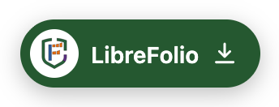
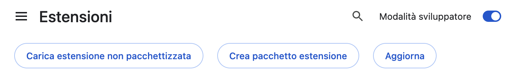
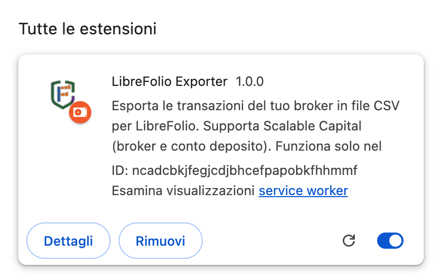
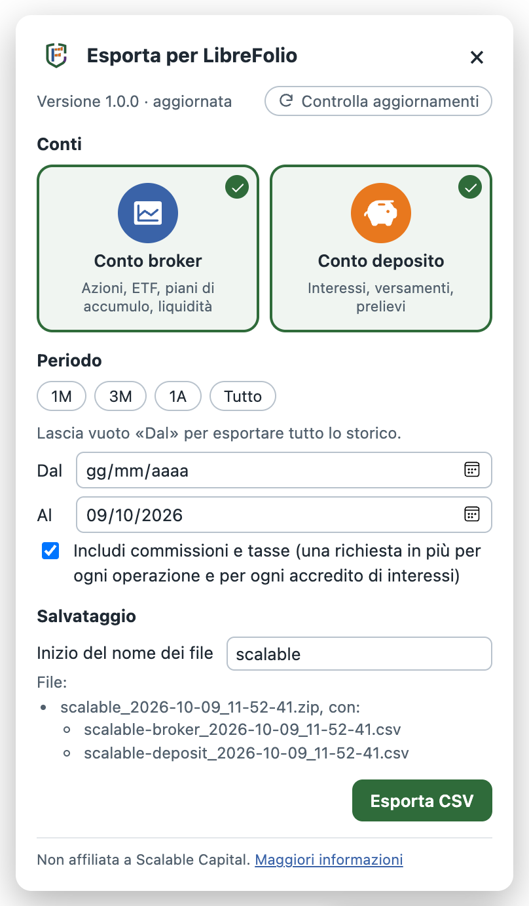
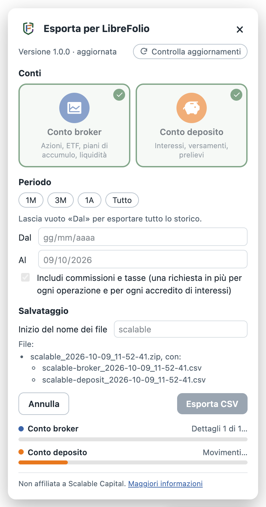
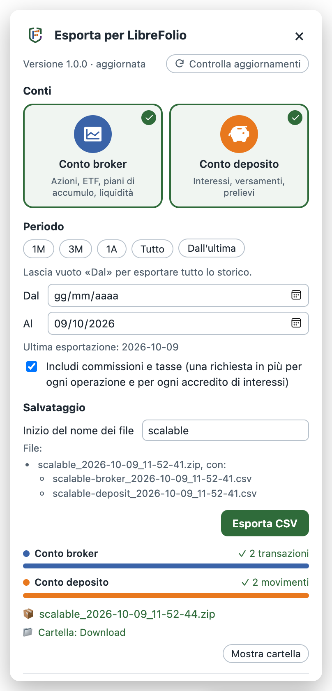

# LibreFolio Exporter

Export your **Scalable Capital** transactions to CSV files for
[LibreFolio](https://github.com/Librefolio/LibreFolio): the **broker account** and the
**overnight account** (*conto deposito*, *Tagesgeld*), on every plan, FREE included.

- 🔒 Runs only in your browser: no server, no credentials, no data sent anywhere.
- 🧪 Early preview (0.x), installed by hand.
- 🤝 Not affiliated with, or endorsed by, Scalable Capital.

<p align="center">
  
</p>

## 📥 Install

Chrome, Edge, Brave or another Chromium browser, version 120 or later.

1. **Download** `librefolio-exporter-<version>.zip` from the
   [latest release](https://github.com/Librefolio/librefolio-exporter/releases/latest).
2. **Unzip** it and put the `librefolio-exporter` folder you get where it can stay: any
   folder works, we suggest `Downloads/chromePlugin`. After the installation Chrome always
   loads the extension from that folder, so don't move or delete it afterwards.
3. Open `chrome://extensions` (`edge://extensions` in Edge) and turn on
   **Developer mode**, top right:

   <p align="center"></p>

4. Click **Load unpacked** and choose the `librefolio-exporter` folder. The extension
   appears in the list:

   <p align="center"></p>

   The ID changes from one computer to another: it depends on the folder.

> [!TIP]
> Install the extension only from this repository's releases. Each ZIP comes with a
> `.sha256` file, its fingerprint: download both into the same folder (here
> `Downloads`) and check that the ZIP is exactly the one published here, with the
> commands for your system below.

<details>
<summary>🍎 Check the ZIP on macOS</summary>

In the Terminal app:

```sh
cd ~/Downloads
shasum -a 256 -c librefolio-exporter-*.zip.sha256
```

The answer must end with `OK`. Anything else: don't install the ZIP, and download it
again.

</details>

<details>
<summary>🐧 Check the ZIP on Linux</summary>

In a terminal:

```sh
cd ~/Downloads
sha256sum -c librefolio-exporter-*.zip.sha256
```

The answer must end with `OK`. Anything else: don't install the ZIP, and download it
again.

</details>

<details>
<summary>🪟 Check the ZIP on Windows</summary>

In PowerShell:

```powershell
cd $HOME\Downloads
Get-ChildItem librefolio-exporter-*.zip | ForEach-Object {
  $expected = (Get-Content "$($_.FullName).sha256").Split(' ')[0]
  "$($_.Name): $((Get-FileHash $_.FullName -Algorithm SHA256).Hash -eq $expected)"
}
```

The answer must end with `True`. Anything else: don't install the ZIP, and download it
again.

</details>

To install a new version later, see [Update](#-update).

## 🚀 Use

1. Log in to Scalable Capital: the **LibreFolio** button appears in the bottom-right
   corner of every page.
2. Click it, choose the accounts and the period, and click **Export CSV**.
3. Choose where to save in Chrome's *Save as* window: any folder.

The two accounts are read side by side, each with its row of progress. With both
accounts you get one ZIP holding the two CSV files: double-click it to extract them.
With one account you get its CSV file. At the end each row says how many transactions
were read, and below them come the saved file, its folder and **Show folder**, which
opens the folder.

<p align="center">
  
  &nbsp;
  
  &nbsp;
  
  <br>
  <sub>From left: ready to export; while exporting, with the choices locked and one row per account; done, with what was read, the file and its folder.</sub>
</p>

The first export reads the whole history. The next ones start from the last export
(**Since last**), so only new transactions are read.

Each account has its CSV file, `scalable-broker_<date>_<time>.csv` and
`scalable-deposit_<date>_<time>.csv`, with the columns of Scalable's official export
([format](docs/FORMAT.md)); with both accounts they come together in
`scalable_<date>_<time>.zip`. LibreFolio will import them through its Scalable plugin.

## 🔄 Update

The top of the panel tells you when a new version is out. To install it:

1. **Download** the new ZIP from the
   [latest release](https://github.com/Librefolio/librefolio-exporter/releases/latest)
   and **unzip** it.
2. **Replace** the old `librefolio-exporter` folder with the new one, in the same place
   (for example `Downloads/chromePlugin`).
3. Open `chrome://extensions` and click the **reload** button ⟳ on the LibreFolio
   Exporter card (bottom right in the picture above).
4. **Reload** the Scalable pages you have open (Cmd+R on macOS, F5 elsewhere): until
   then they keep the old version, and its panel asks you to reload.

Your settings and the dates of the last exports stay, as long as the folder stays the
same: Chrome knows the extension by its folder, and a copy loaded from another folder
would be a second extension, starting from scratch.

## 🛡️ Privacy and risks

- 🔒 **Privacy**: your data stays in your browser and on your computer. The only other
  request is the update check to GitHub. Details in [PRIVACY.md](PRIVACY.md).
- ⚠️ **Risks**: the extension uses the web app's internal interface, which Scalable can
  change at any time, and Scalable's terms allow it to block access when it suspects
  that programs are being used. The extension is built for light use: read
  [docs/RISKS.md](docs/RISKS.md) before using it.

## 📚 More

- [How it works](docs/HOW-IT-WORKS.md): accounts, period, saving, update check,
  permissions, diagnostics.
- [CSV format](docs/FORMAT.md).
- [Development](docs/DEVELOPMENT.md): tests, structure, release.
- [Changelog](CHANGELOG.md).

## 🙏 Credits

The GraphQL operations follow those used by public projects, first of all
[Scalable-Capital-Transactions-Exporter](https://github.com/matthesvoss/Scalable-Capital-Transactions-Exporter)
by Matthes Voß (MIT). The account icons come from [Phosphor Icons](https://phosphoricons.com)
(MIT). See [THIRD_PARTY_NOTICES.md](THIRD_PARTY_NOTICES.md).

## 📜 License

[GNU Affero General Public License v3.0](LICENSE), like LibreFolio.
